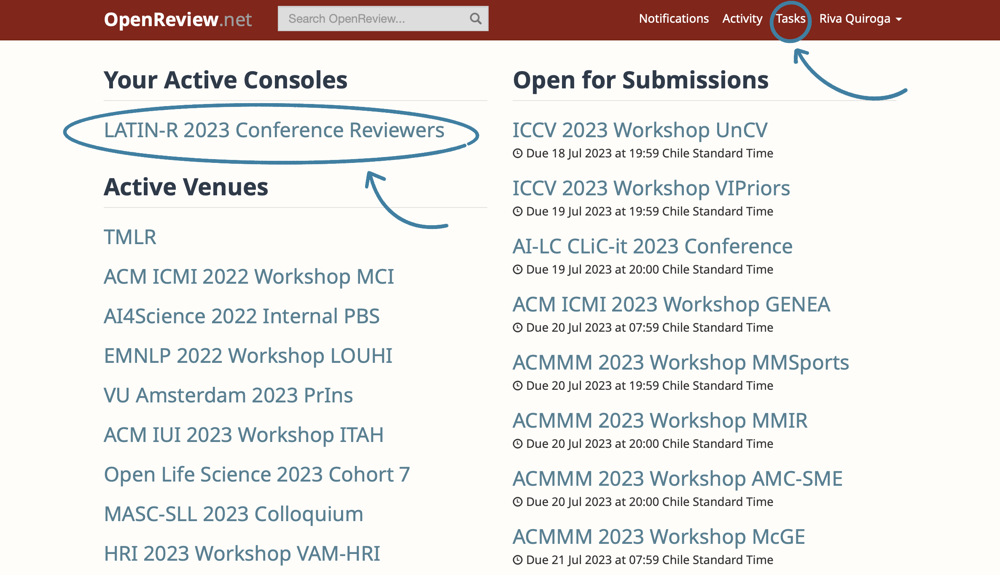
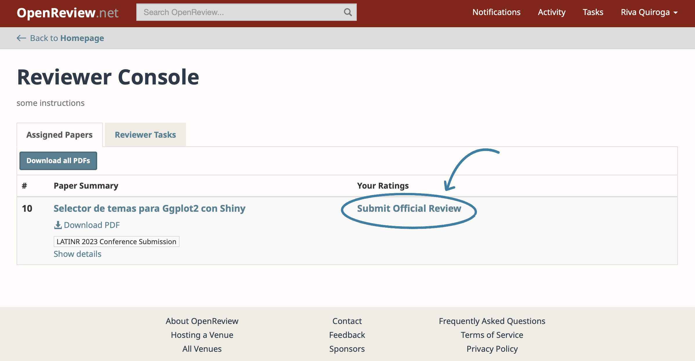
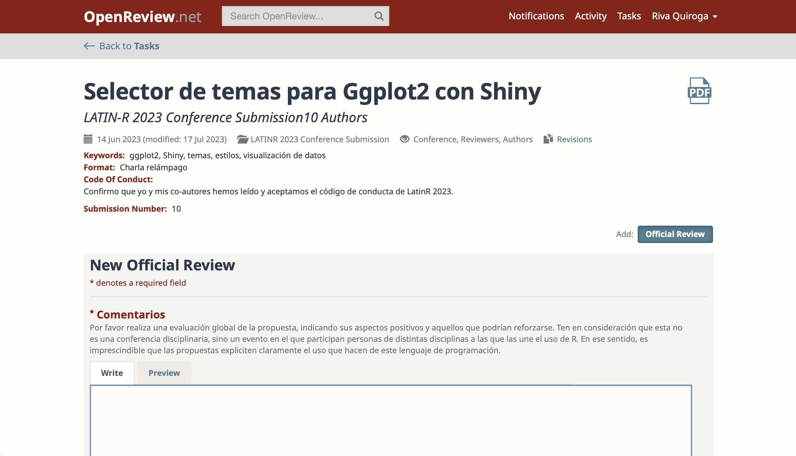

# Uso de OpenReview para la evaluación de envíos

¡Hola! Muchas gracias por ser parte del Comité Científico de LatinR 2023. El trabajo que realizas es central para el éxito y continuidad de la conferencia :sparkles:.

El siguiente documento contiene indicaciones sobre cómo realizar la evaluación de propuestas en la plataforma OpenReview y qué esperar en cada fase del proceso.

## Etapa 1: Invitación y registro en la plataforma

Como se señala en el correo que te enviamos desde la plataforma, para aceptar la invitación debes hacer clic en el enlace que ahí se indica. OpenReview te enviará un correo en el que confirma que has aceptado la invitación, sugiere que agregues el correo [noreply@openreview.net](mailto:noreply@openreview.net) a tus contactos para que futuros mensajes no se vayan a la carpeta de spam e indica que las chairs de la conferencia se pondrán en contacto contigo acerca de los próximos pasos. Este documento es nuestra forma de explicar los siguientes pasos del proceso. 

### Registro en la plataforma

Si aún no tienes una cuenta, puedes crearla luego de aceptar la invitación. **Es necesario que utilices el mismo correo al que te hemos escrito para que OpenReview te asigne correctamente las revisiones.** Si ya tienes una cuenta en OpenReview con otra dirección de correo, [puedes agregar el correo al que te enviamos la invitación como dirección adicional en tu perfil](https://docs.openreview.net/getting-started/creating-an-openreview-profile/add-or-remove-an-email-address-from-your-profile). Si prefieres crear una cuenta con otro correo, puedes hacerlo, pero te pedimos que agregues la dirección a la que te enviamos la invitación como correo adicional, de lo contrario no podremos asignarte correctamente las revisiones. 
Ten encuenta que OpenReview enviará futuros mensajes a la cuenta que hayas seleccionado como predeterminada.  

## Etapa 2: Asignación de propuestas

A partir del viernes 21 de julio comenzará el proceso de asignación de propuestas para revisar. OpenReview te enviará un mensaje a tu correo electrónico por cada uno de los trabajos asignados. El último correo de confirmación deberías recibirlo no más allá del lunes 24 de julio a las 14:00 UTC. 

## Etapa 3: Revisión de las propuestas

Existen distintas formas para acceder a las propuestas asignadas. 

### Desde la plataforma

Desde la página de inicio, puedes acceder a las propuestas desde tu lista de consolas activas o desde el menú Tasks. La diferencia es que en la consola te aparecerán todas las propuestas asignadas, mientras que en Tasks solo aquellas que tienen pendiente la revisión. 

Si haces clic en Tasks, verás la lista de conferencias en las que participas y bajo el nombre de la conferencia la cantidad de tareas pendientes. Si haces clic sobre el número de tareas, se desplegará el detalle de cada una con la fecha de entrega. Si haces clic en el número del envío podrás acceder a los detalles de este y al formulario de evaluación. 

")

Si en la página de inicio accedes a la consola de revisores, podrás ver la lista completa de trabajos asignados, junto con la opción enviar tu revisión.  Al hacer clic en ella podrás encontrarás además del formulario de evaluación, los detalles de la misma (incluida la opción de abrir el PDF en una nueva ventana en vez de tener que descargarlo) . 

### Desde el correo de asignación de propuestas

También es posible acceder a cada propuesta desde el mensaje que recibiste cuando te asignamos la propuesta. Si haces clic en el enlace incluido ahí, llegarás a una página que muestra los detalles del envío y la opción para agregar tu evaluación:

. En la esquina inferior derecha se encuentra el botón Official Review, que hará que se despliegue el formulario de revisión.")

Sea cual sea la opción que elijas, al final te encontrarás con una página con los detalles de la propuesta y el formulario de evaluación:

### El formulario de evaluación

Al igual que en ediciones anteriores, hemos mantenido el formulario de evaluación lo más sencillo posible. Contiene tres campos:

#### Comentarios
En ese campo se espera que ingreses tu evaluación global de la propuesta, indicando sus aspectos positivos y aquellos que podrían reforzarse. Ten en consideración que esta no es una conferencia disciplinaria, sino un evento en el que participan personas de distintas disciplinas a las que las une el uso de R. En ese sentido, es imprescindible que las propuestas expliciten claramente el uso que hacen del lenguaje de programación. Usualmente ese es un aspecto que es necesario señalar como oportunidad de mejora de los trabajos. ¿Qué paquetes se utilizaron? Si existe variedad de paquetes para alguna tarea en particular, ¿por qué se prefirió ese?
Es posible que te haya tocado revisar una propuesta que no es exactamente de tu área disciplinar, pero que comparte paquetes o métodos con los que estás familiarizados. Es habitual en esos casos sugerir a quienes elaboraron la propuesta qué aspectos sería importante aclarar en la presentación para que la audiencia pueda entender el tema que aborda. 
Si la propuesta hace un uso recurrente de acrónimos o siglas que no son transparentes para cualquier persona (o que pueden significar cosas distintas, según la disciplina), también es importante sugerir aclara ese punto. 

#### Resultado
En este campo tienes que señalar el resultado de tu evaluación. Las opciones son cuatro:

- Sugiero aceptar la propuesta tal como está
- Sugiero aceptar esta propuesta si se le realizan modificaciones menores
- Sugiero aceptar esta propuesta solo si se le realizan modificaciones mayores
- Sugiero rechazar esta propuesta

#### Formato sugerido

En este campo debes indicar el formato en que sugieres que la propuesta se presente en la conferencia, en caso de ser aceptada. Por favor, antes de responder esta pregunta, revisa qué fue lo que seleccionaron sus autores. En general tratamos de mantener el formato seleccionado, salvo en situaciones como las siguientes:

- Se envió una propuesta para presentación de 20 minutos, pero el resumen muestra un trabajo en proceso o muy acotado para el que bastaría una charla relámpago de 5 minutos. 
- Se envió una propuesta de charla relámpago, pero el resumen evidencia que 5 minutos va a ser poco tiempo para desarrollar de forma adecuada las ideas planteadas. 

En general preferimos no modificar el formato de envío de quienes seleccionaron la opción póster. Esto se debe a que ese formato es elegido usualmente porque quienes enviaron la propuesta están en búsqueda del diálogo y retroalimentación que se genera en la sesión de pósters, o bien, que no les acomoda presentar frente a público. 

### ¿Dudas?
Si tienes cualquier consulta durante el proceso de evaluación, no dudes en contactarnos a través del correo de la conferencia: latinr@gmail.com. Te agredeceríamos incluir el número y nombre de la propuesta sobre la que tienes dudas para que nos sea más fácil responder.